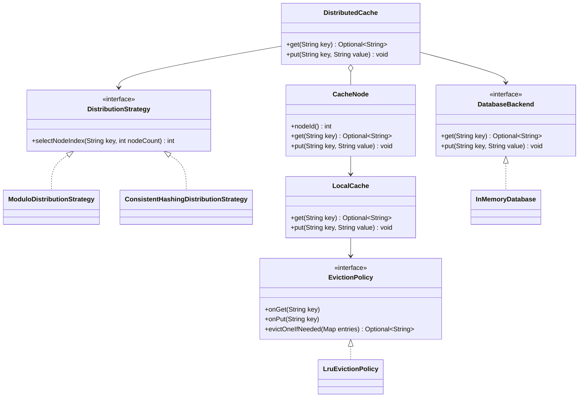

# Distributed Cache (LLD Design + Implementation)

## Functional Requirements
- `get(key)` — return value from cache if present; on miss, load from database, store in cache, return.
- `put(key, value)` — store on the correct cache node per distribution strategy; database is updated (see assumptions).
- Multiple cache nodes; **number of nodes is configurable**.
- Each node has **limited capacity**; current eviction: **LRU** (design allows other policies later).

## Assumptions
- Keys are unique.
- A `DatabaseBackend` interface exists; this solution provides an **in-memory** implementation for LLD.
- **No real network** between nodes: each “node” is an in-process object (distributed cache LLD exercise).
- On `put(key, value)`: value is written to **both** the backing database and the selected cache node (write-through style).

## How Data Is Distributed
- A **`DistributionStrategy`** maps `key → node index` in `[0, numberOfNodes)`.
- Default implementation: **`ModuloDistributionStrategy`**: `abs(hash(key)) % numberOfNodes` (same idea as `hash(key) % N` with safe handling of `hashCode` sign).
- The design is **open for extension**: you can plug in **`ConsistentHashingDistributionStrategy`** (skeleton provided) without changing `DistributedCache` clients.

## How Cache Miss Is Handled
1. Resolve node index via `DistributionStrategy`.
2. `LocalCache` on that node: if key exists → return.
3. If miss → `DatabaseBackend.get(key)`; if DB has value → `LocalCache.put` on that node → return.
4. If DB also has no value → return empty `Optional`.

## How Eviction Works
- Each node owns a **`LocalCache`** with a fixed **capacity** (entries per node).
- Eviction is delegated to an **`EvictionPolicy`** (Strategy pattern).
- **LRU** is implemented in `LruEvictionPolicy` using access order tracking (least recently used is evicted when capacity is exceeded).
- **Note:** with **write-through** `put`, a key may still exist in the database after LRU removes it from RAM; the next `get` can **read-through** and repopulate the shard (see demo output in `App`).
- **MRU** / **LFU** sample policies are included (`MruEvictionPolicy`, `LfuEvictionPolicy`) to show extensibility; production versions would extend bookkeeping as needed.

## SOLID & Design Patterns (Summary)
| Concern | Pattern / principle |
|--------|----------------------|
| Key → node routing | **Strategy** (`DistributionStrategy`) |
| Eviction algorithm | **Strategy** (`EvictionPolicy`) |
| Single entry API | **Facade** (`DistributedCache`) |
| Swappable DB | **Dependency inversion** (`DatabaseBackend`) |
| Node construction | **Factory** (`CacheNodeFactory`) |
| SRP | `DistributedCache` orchestrates; `CacheNode` stores; policies encapsulate algorithms |

## Mermaid Class Diagram


## How Future Extensibility Is Supported
- **New distribution**: implement `DistributionStrategy`, inject into `DistributedCache` (OCP).
- **New eviction**: implement `EvictionPolicy`, inject into `LocalCache` / `CacheNodeFactory` (OCP).
- **Consistent hashing**: `ConsistentHashingDistributionStrategy` is a placeholder ring; real CH adds virtual nodes + rebalancing without API changes.

## How to Compile & Run
```bash
cd "distributed cache/answer"
javac com/example/distributedcache/*.java
java com.example.distributedcache.App
```

## Answer Package (`com.example.distributedcache`)
- `DistributedCache` — Facade: `get` / `put`, routes to nodes + DB
- `CacheNode` — one shard; wraps `LocalCache` (thread-safe per node)
- `LocalCache` — bounded store + eviction delegation
- `EvictionPolicy`, `LruEvictionPolicy`, `MruEvictionPolicy`, `LfuEvictionPolicy` — Strategy (eviction)
- `EvictionPolicies` — Factory methods for policy suppliers (one instance per node)
- `DistributionStrategy`, `ModuloDistributionStrategy`, `ConsistentHashingDistributionStrategy` — Strategy (sharding)
- `DatabaseBackend`, `InMemoryDatabase` — Dependency inversion (DB stub)
- `App` — runnable demo
