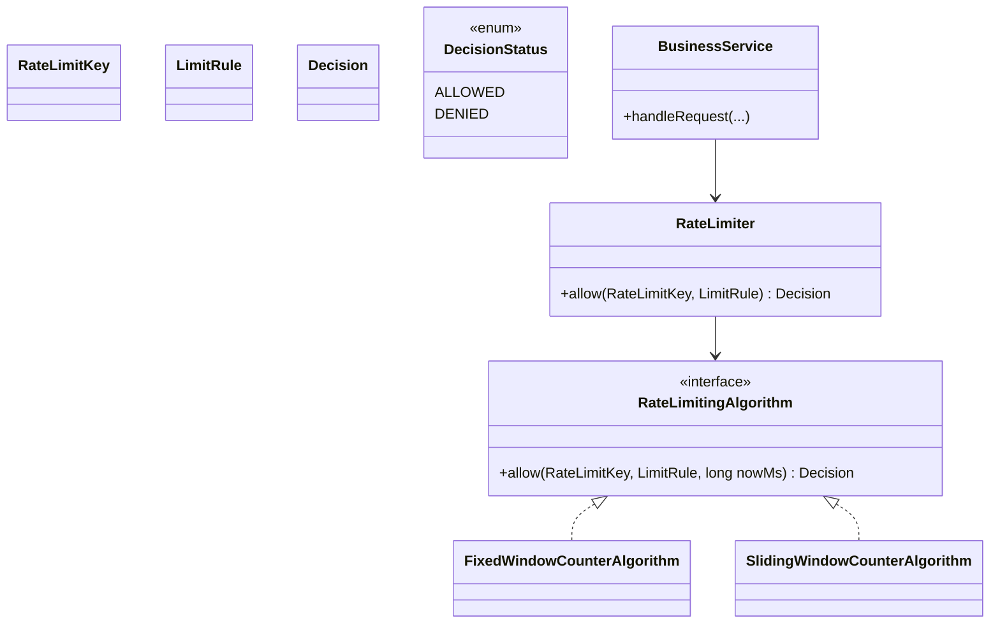

# Rate Limiting System (LLD Design + Implementation)

## Problem Scope
- Rate limiting is applied **only before external paid resource calls**.
- Incoming client API requests are **not** directly rate-limited.
- Business logic runs first; limiter is consulted only when external call is required.

## Functional Requirements Covered
- `allow/deny` decision for each external call.
- Pluggable algorithms (Strategy pattern):
  - `FixedWindowCounter`
  - `SlidingWindowCounter`
- Configurable limits (e.g., `5 per minute`, `1000 per hour`).
- Configurable key dimensions (tenant/customer/api-key/provider).
- Thread-safe and efficient in-memory LLD implementation.

## Main API (used by internal service)
- `RateLimiter.allow(RateLimitKey key, LimitRule rule): Decision`

## Mermaid Flowchart (Call-site integration)
```mermaid
flowchart TD
  A[Client API Request] --> B[Business Logic]
  B --> C{External resource needed?}
  C -->|No| D[Return response]
  C -->|Yes| E[Build RateLimitKey + LimitRule]
  E --> F[RateLimiter.allow(...)]
  F --> G{Allowed?}
  G -->|Yes| H[Call external provider]
  H --> I[Return success]
  G -->|No| J[Reject/Graceful fallback]
```

## Mermaid Class Diagram


## Design Decisions
- **Open/Closed Principle:** new algorithms (Token Bucket, Leaky Bucket, Sliding Log) can be added by implementing `RateLimitingAlgorithm`.
- **Single Responsibility:** limiter orchestration is separated from algorithm-specific state logic.
- **Dependency Injection:** business service receives `RateLimiter`; algorithm can be swapped without business logic changes.
- **Thread safety:** per-key counters use `ConcurrentHashMap` + atomic counters/deques under synchronized sections where needed.

## Algorithm Trade-offs
- **Fixed Window Counter**
  - Pros: simple, memory-efficient, fast.
  - Cons: burst at window boundary (end of one window + start of next).
- **Sliding Window Counter**
  - Pros: smoother throttling; better approximates true rolling window.
  - Cons: more bookkeeping and slightly higher memory/CPU than fixed window.

## Compile & Run
```bash
cd "Rate Limiting System/answer"
javac com/example/ratelimiter/*.java
java com.example.ratelimiter.App
```

