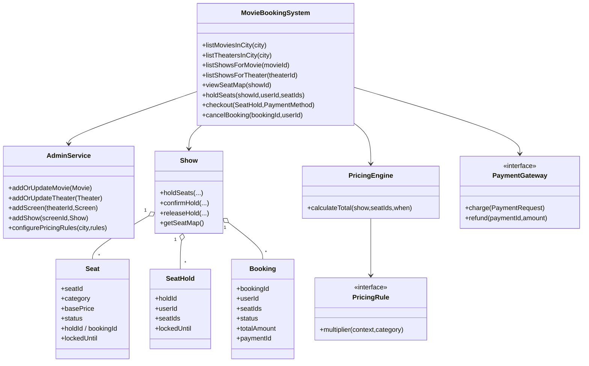

# Movie Ticket Booking (LLD Design + Implementation)

## Requirements
### User operations
- View movies in a city.
- View theaters in a city.
- View shows for a movie (or theater).
- View seat map for a show.
- Select and lock seats for a fixed duration.
- Book tickets (payment).
- Cancel booking before show time and get refund.

### Admin operations
- Add/update movies.
- Add/update theaters.
- Add screens in a theater.
- Add shows for a screen.
- Configure pricing rules (show-based, day/time-based, demand/surge).

## Mermaid Flow Chart (LLD Design)
```mermaid
flowchart TD
  subgraph User["User"]
    U1[Pick city] --> U2[Pick movie/theater] --> U3[Pick show]
    U4[View seat map] --> U5[Select seats]
    U5 --> U6[Lock seats (5 min)]
    U6 --> U7[Proceed to payment]
    U7 -->|SUCCESS| U8[Confirm booking]
    U7 -->|FAILED| U9[Release seats]
    U8 --> U10[Cancel booking (before showtime)]
  end

  subgraph System["System (In-memory LLD)"]
    S1[Catalog/AdminService]
    S2[Show (seat map + seat hold/book state)]
    S3[SeatHold + Booking repositories]
    S4[PricingEngine (rules)]
    S5[PaymentGateway (external adapter)]
  end

  S1 --> S2
  S2 --> S3
  S3 --> S4
  S4 --> S5
  S2 -->|held seats| S3
  S2 -->|confirmed seats| S3
  S2 -->|availability updated| U4
```

## Mermaid Class Diagram


## How to Compile & Run
```bash
cd movie-ticket-booking/answer
javac -d . com/example/movieticketbooking/*.java
java -cp . com.example.movieticketbooking.App
```

## Implementation Notes (LLD Focus)
- Seat holding uses **pessimistic locking** at the `Show` level via `ReentrantLock`.
- The system ensures **atomicity**: either all requested seats are HELD together or none are.
- A `SeatHold` expires after `HOLD_DURATION_MILLIS` (default: 5 minutes) and is cleaned up on access.
- Payment is performed outside the seat lock; the system re-validates the hold before confirming.
- Pricing supports:
  - show-based multiplier (e.g., IMAX)
  - day/time multiplier (e.g., weekend evening)
  - demand/surge multiplier (effective demand = booked + active held)
- Cancellation checks that booking is before showtime, then releases seats and triggers refund.

