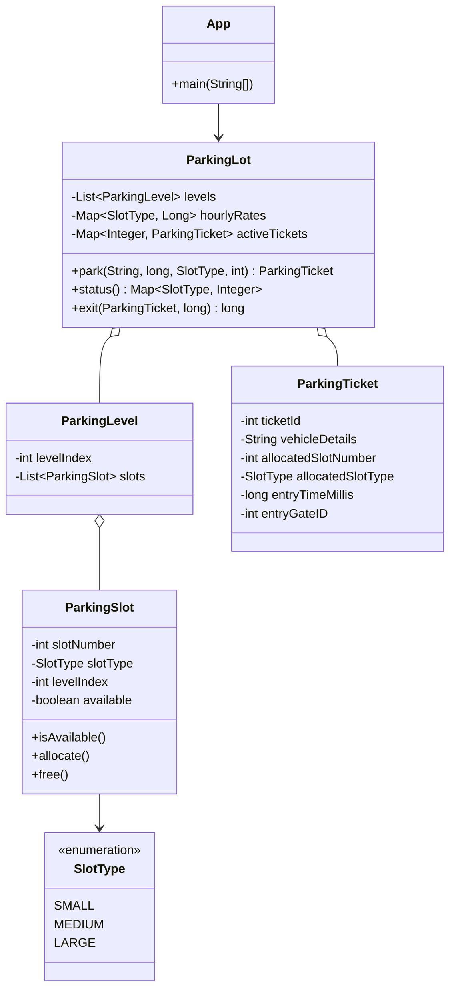

# Multilevel Parking Lot Design (LLD)

## Problem Summary
Design a multilevel parking lot system with:
1. Three slot types: `Small` (2-wheelers), `Medium` (cars), `Large` (buses)
2. Slot-type-based hourly billing (not vehicle-type-based)
3. Multiple entry gates and **nearest available compatible slot** assignment based on `entryGateID`
4. APIs:
   - `park(vehicleDetails, entryTime, requestedSlotType, entryGateID)` -> `ParkingTicket`
   - `status()` -> availability by slot type
   - `exit(parkingTicket, exitTime)` -> bill amount

This solution uses SOLID-friendly decomposition:
- `ParkingLot` orchestrates operations
- `ParkingLevel` and `ParkingSlot` store physical layout
- `ParkingTicket` stores allocation + entry time
- Rates are stored per `SlotType` and used during billing

## Implementation Notes (to match the rules)
- **Compatibility / allowed slot types** is derived from `requestedSlotType`:
  - `SMALL` => `SMALL`, `MEDIUM`, `LARGE`
  - `MEDIUM` => `MEDIUM`, `LARGE`
  - `LARGE` => `LARGE` only
- **Nearest available slot**:
  - We map `entryGateID` to a nearest level using `entryGateID % numberOfLevels`
  - For each free compatible slot, compute `distance = abs(levelIndex - nearestLevel)`
  - Choose the smallest distance; if tied, choose the smallest `slotNumber`
- **Billing**:
  - Duration is computed from `exitTime - entryTime`
  - Hours are `ceil(durationMillis / 1 hour)` (partial hours are billed as a full hour)
  - Total = `allocatedSlotTypeRatePerHour * hours`

## Mermaid Class Diagram


## How to Compile & Run
```bash
cd "parking lot design/answer"
javac com/example/parkinglot/*.java
java com.example.parkinglot.App
```

## Console Inputs (Demo)
The demo `App` prompts for:
- number of levels
- slots per level for `Small`, `Medium`, `Large`
- hourly rates for each slot type
- number of gates

Then it lets you perform:
- `park` (creates ticket)
- `status`
- `exit` (generates bill)

