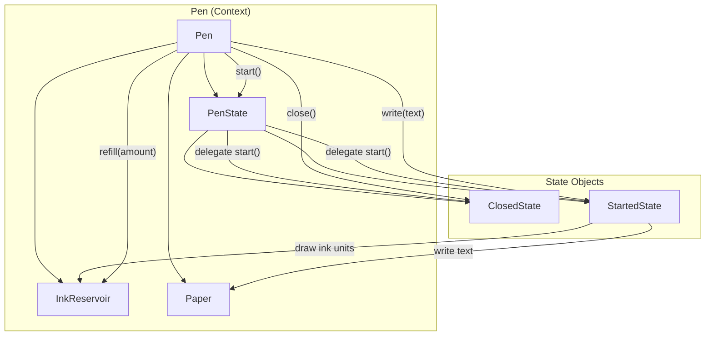
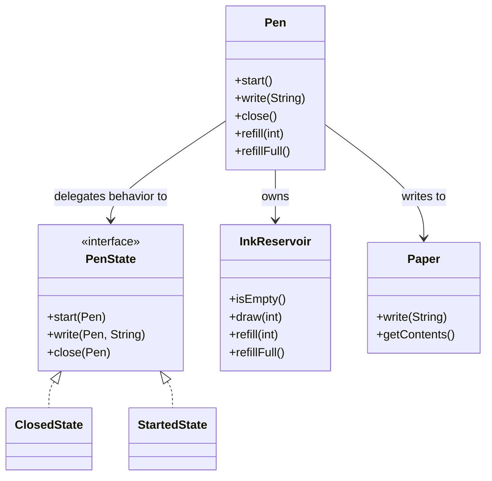

# Pen (LLD Design + Implementation)

## Requirements
- `start()` enables the pen for writing (requires ink).
- `write(String text)` writes on paper while the pen is started and has enough ink.
- `close()` disables the pen from writing.
- `refill(...)` adds ink back to the pen.

## Mermaid Flow Chart (LLD Design)


## Mermaid Class Diagram


## How to Compile & Run
```bash
cd pen/answer
javac com/example/pen/*.java
java com.example.pen.App
```

## Notes
- Each character consumes **1 ink unit**.
- If you try to `write(...)` while closed (or without enough ink), the implementation throws an `IllegalStateException` / `IllegalArgumentException`.

