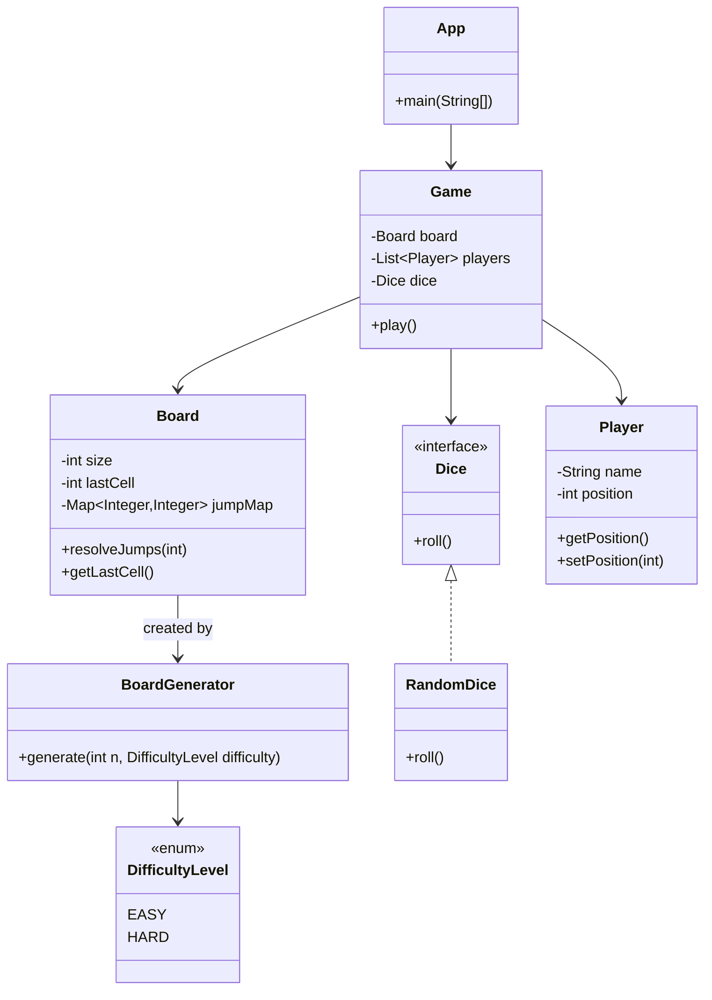

# Snakes & Ladders (LLD Design + Implementation)

## Requirements Covered
- Input: `n` (board size is `n x n`), `x` (number of players), `difficulty_level` (`easy` / `hard`)
- Place **exactly `n` snakes** and **exactly `n` ladders** randomly
- Dice roll: uniform random `1..6`
- Each player starts outside the board at position `0`
- Move rule: if `pos + dice > n*n`, no movement
- Jump rule: if a piece lands on a snake head or ladder start, it is moved to the tail/end (chain-jumps allowed, but generation ensures **no cycles**)
- Game continues while there are at least **2 active players** (players not yet at the last cell). The game stops once fewer than 2 players remain active.

## Mermaid Class Diagram (LLD)


## Mermaid Flow Chart (Game Flow)
```mermaid
flowchart TD
  A([User Input]) --> B[BoardGenerator.generate(n, difficulty)]
  B --> C[Board(size, jumpMap)]
  C --> D[Game(players, dice, board)]
  D --> E{Active players >= 2?}
  E -- No --> Z([Print winners & game over])
  E -- Yes --> F[For each player's turn]
  F --> G[Roll dice 1..6]
  G --> H{pos + roll > lastCell?}
  H -- Yes --> I[No movement]
  H -- No --> J[Move to proposedPos]
  J --> K[Resolve jumps (follow start->end links)]
  K --> L{Reached lastCell?}
  L -- No --> F
  L -- Yes --> M[Mark player won]
  M --> E
```

## Compile & Run
```bash
cd "snake & ladder/answer"
javac com/example/snakeandladder/*.java
java com.example.snakeandladder.App
```

### Input Format (Console)
The program will prompt for:
1. `n` (board size)
2. `x` (players)
3. `difficulty_level` (`easy` or `hard`)

